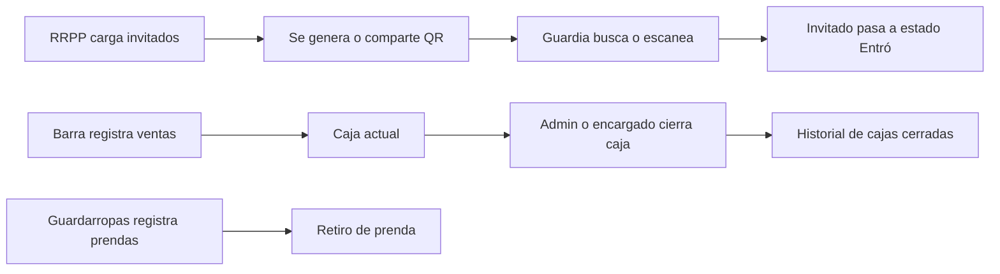

<div align="center">

# ✨ Divine App

### Gestión integral para eventos, boliches y fiestas

Puerta · Listas · QR · Scanner · Kioskito · Guardarropas · Caja · Stock · Administración

<br>


**Una sola aplicación para controlar toda la operación de la noche.**

</div>

---

## 📌 Índice

- [Descripción](#-descripción)
- [Módulos](#-módulos)
- [Roles y permisos](#-roles-y-permisos)
- [Flujo operativo](#-flujo-operativo)
- [Caja actual e historial](#-caja-actual-e-historial)
- [Productos y categorías](#-productos-y-categorías)
- [Tecnologías](#-tecnologías)
- [Instalación con Docker](#-instalación-con-docker)
- [Variables de entorno](#️-variables-de-entorno)
- [Base de datos](#️-base-de-datos)
- [Migraciones](#-migraciones)
- [Estructura del proyecto](#-estructura-del-proyecto)
- [Seguridad y reglas importantes](#-seguridad-y-reglas-importantes)
- [Errores frecuentes](#-errores-frecuentes)
- [Comandos útiles](#-comandos-útiles)

---

## 🚀 Descripción

**Divine App** es una aplicación web responsive para administrar eventos, boliches, fiestas y locales nocturnos desde una única interfaz.

Está diseñada para trabajar en tiempo real desde computadoras, tablets y celulares, permitiendo separar claramente las tareas de:

- 👑 Administración.
- 🚪 Guardia y control de puerta.
- 👤 RRPP y públicas.
- 🛒 Barra, Kioskito y Guardarropas.
- 📱 Clientes que consultan la carta pública.

La aplicación utiliza sesiones PHP, permisos por rol y una base de datos MySQL para mantener listas, ventas, cierres de caja, productos, prendas, QR y movimientos internos.

---

## 🧩 Módulos

### 🚪 Listas en puerta

Permite:

- Crear listas normales.
- Crear listas de cumpleaños.
- Agregar personas individualmente.
- Pegar listas completas.
- Buscar invitados.
- Consultar estados de ingreso.
- Generar y compartir QR.
- Ver estadísticas por lista.

Estados disponibles:

```txt
no_vino
entro
se_fue
```

Regla de eliminación:

| Rol | `no_vino` | `entro` | `se_fue` |
|---|:---:|:---:|:---:|
| Admin | ✅ | ✅ | ✅ |
| RRPP / Pública | ✅ | ❌ | ❌ |
| Guardia / Puerta | ❌ | ❌ | ❌ |

Una RRPP no puede eliminar a una persona que ya ingresó o que ya se retiró.

---

### 📷 Scanner QR

Permite:

- Leer entradas usando la cámara.
- Validar que el QR exista.
- Verificar que esté habilitado.
- Evitar el uso duplicado.
- Confirmar el ingreso.
- Cambiar automáticamente el estado a `entro`.

> [!IMPORTANT]
> La cámara requiere `HTTPS` o `localhost`.

---

### 🛒 Kioskito

Kioskito concentra las tareas de:

- Registrar ventas.
- Agregar productos al carrito.
- Sumar o restar cantidades.
- Seleccionar método de pago.
- Consultar la caja abierta.
- Cerrar caja.
- Gestionar Guardarropas desde el mismo módulo.

Métodos de pago:

```txt
efectivo
transferencia
tarjeta
regalo
```

La aplicación evita ventas duplicadas mediante `client_sale_id`.

---

### 🧥 Guardarropas

Guardarropas se encuentra **dentro de Kioskito** y comparte el mismo rol de acceso.

Permite:

- Asignar número y código.
- Guardar nombre.
- Guardar DNI opcional.
- Guardar teléfono opcional.
- Registrar el cobro.
- Buscar prendas.
- Marcar una prenda como retirada.
- Consultar ingresos y retiros.

Estados:

```txt
pendiente
retirado
```

---

### 🧾 Cierre de caja

Cada cierre guarda:

- Usuario que cerró.
- Primera venta incluida.
- Última venta incluida.
- Cantidad de ventas.
- Total general.
- Total en efectivo.
- Total por transferencia.
- Total con tarjeta.
- Total en regalos.
- Fecha y hora.
- Resumen de productos.

La caja actual contiene únicamente las ventas posteriores al último cierre.

---

### 📦 Stock del contenedor

Disponible exclusivamente para administración.

Permite:

- Separar stock interno y externo.
- Registrar cantidades.
- Ajustar existencias.
- Detectar faltantes.
- Marcar stock bajo.
- Generar una lista para compartir.
- Crear artículos personalizados.

Estado sugerido:

```txt
Agotado: cantidad = 0
Stock bajo: cantidad <= límite configurado
En stock: cantidad > límite configurado
```

---

### 👑 Panel administrativo

Permite:

- Ver los contadores de la caja actual.
- Ver ingresos de puerta.
- Ver ingresos de Guardarropas.
- Consultar productos vendidos.
- Administrar usuarios.
- Cambiar roles.
- Administrar productos.
- Ver QR.
- Consultar cajas cerradas.
- Eliminar cierres del historial de forma segura.
- Acceder al stock del contenedor.
- Auditar acciones mediante logs.

---

### 📖 Carta pública

La carta está disponible para todos:

- Admin.
- Guardia.
- RRPP.
- Barra.
- Clientes sin sesión.

Debe permanecer accesible sin exigir inicio de sesión:

```txt
/menu.php
```

---

## 🔐 Roles y permisos

La aplicación utiliza cuatro roles:

```sql
ENUM('admin', 'usuario', 'puerta', 'kiosko')
```

### Matriz de permisos

| Función | Admin | Guardia / Puerta | RRPP / Pública | Kioskito / Guardarropas |
|---|:---:|:---:|:---:|:---:|
| Ver carta | ✅ | ✅ | ✅ | ✅ |
| Ver todas las listas | ✅ | ✅ | ❌ | ❌ |
| Ver listas propias | ✅ | ❌ | ✅ | ❌ |
| Crear listas | ✅ | ❌ | ✅ | ❌ |
| Agregar personas | ✅ | ❌ | ✅ | ❌ |
| Eliminar personas `no_vino` | ✅ | ❌ | ✅ | ❌ |
| Eliminar personas que ya ingresaron | ✅ | ❌ | ❌ | ❌ |
| Cambiar estados de ingreso | ✅ | ✅ | ❌ | ❌ |
| Usar Scanner | ✅ | ✅ | ❌ | ❌ |
| Generar QR | ✅ | Opcional | ✅, propios | ❌ |
| Registrar ventas | ✅ | ❌ | ❌ | ✅ |
| Usar Guardarropas | ✅ | ❌ | ❌ | ✅ |
| Ver caja actual | ✅ | ❌ | ❌ | ✅ |
| Cerrar caja | ✅ | ❌ | ❌ | Según configuración |
| Ver historial de cajas | ✅ | ❌ | ❌ | ❌ |
| Eliminar cajas del historial | ✅ | ❌ | ❌ | ❌ |
| Gestionar productos | ✅ | ❌ | ❌ | ❌ |
| Gestionar stock | ✅ | ❌ | ❌ | ❌ |
| Gestionar usuarios | ✅ | ❌ | ❌ | ❌ |
| Ver Panel Admin | ✅ | ❌ | ❌ | ❌ |

### 👑 `admin`

Acceso completo a todos los módulos y acciones administrativas.

### 🚪 `puerta`

Nombre visible:

```txt
Guardia / Puerta
```

Accede a:

- Listas en puerta.
- Todas las listas.
- Scanner.
- Cambio de estados.
- Carta.

No puede crear listas, eliminar personas, vender ni administrar usuarios.

### 👤 `usuario`

Nombre visible:

```txt
RRPP / Pública
```

Accede a:

- Sus propias listas.
- Creación de listas.
- Carga de invitados.
- Pegado masivo.
- QR de sus invitados.
- Carta.

No puede ver listas ajenas ni cambiar estados de ingreso.

### 🛒 `kiosko`

Nombre visible:

```txt
Kioskito / Guardarropas
```

Accede a:

- Kioskito.
- Caja actual.
- Guardarropas.
- Carta.

Guardarropas no aparece como tarjeta independiente en el inicio: se encuentra dentro de Kioskito.

---

## 🔄 Flujo operativo



### Separación de responsabilidades

```txt
RRPP       → carga y mantiene sus invitados
Puerta     → confirma ingresos
Kioskito   → registra ventas y prendas
Admin      → supervisa y administra todo
```

---

## 💰 Caja actual e historial

### Caja actual

La caja abierta debe consultar únicamente ventas posteriores al último cierre.

Conceptualmente:

```sql
SELECT *
FROM kiosko_sales
WHERE id > ultimo_to_sale_id
ORDER BY id DESC;
```

La caja actual se utiliza para:

- Total de Kioskito.
- Productos vendidos.
- Totales por medio de pago.
- Cierre siguiente.

### Historial de cajas cerradas

El Panel Admin muestra un bloque independiente con:

- Número de cierre.
- Usuario que cerró.
- Monto.
- Fecha.
- Cantidad de ventas.
- Efectivo.
- Transferencia.
- Tarjeta.
- Regalos.
- Botón para eliminar del historial.

La eliminación debe ser lógica:

```sql
deleted_at DATETIME NULL
```

Al eliminar un cierre se actualiza `deleted_at`, pero se conserva `to_sale_id`.

Esto evita que las ventas cerradas reaparezcan en la caja actual.

---

## 🧃 Productos y categorías

Los productos se agrupan por categoría con un orden persistente.

Orden recomendado:

| Orden | Categoría |
|---:|---|
| 1 | Vasos |
| 2 | Vinos |
| 3 | Champagnes |
| 4 | Cervezas |
| 5 | Sin alcohol |
| 6 | Combos |
| 7 | Shots |
| 8 | Kiosko |
| 9 | Extras |
| 99 | Otros |

Campos utilizados:

```sql
category_order TINYINT UNSIGNED NOT NULL DEFAULT 99
sort_order INT UNSIGNED NOT NULL DEFAULT 0
```

Consulta recomendada:

```sql
SELECT *
FROM products
WHERE active = 1
ORDER BY
    category_order ASC,
    sort_order ASC,
    price ASC,
    name ASC;
```

Así se muestran primero todos los vasos, luego todos los vinos, champagnes, cervezas y el resto de categorías.

---

## 🧩 Tecnologías

| Capa | Tecnología |
|---|---|
| Frontend | HTML, CSS y JavaScript |
| Backend | PHP 8+ |
| Base de datos | MySQL 8 |
| Autenticación | PHP Sessions |
| Servidor web | Apache |
| Contenedores | Docker y Docker Compose |
| Administración DB | phpMyAdmin |
| QR | Tokens únicos por persona |

---

## 🐳 Instalación con Docker

### 1. Clonar o copiar el proyecto

Estructura mínima:

```txt
divine_app/
├── src/
├── db/
├── Dockerfile
├── docker-compose.yml
└── .env
```

### 2. Configurar `.env`

```env
NAME_APP=Divine
APP_VERSION=1.0.0
APP_AUTHOR=Nicko

MYSQL_ROOT_PASSWORD=cambiar_root
MYSQL_DATABASE=divine_db
MYSQL_USER=usuario
MYSQL_PASSWORD=cambiar_password

DB_HOST=mysql
DB_PORT=3306
DB_NAME=divine_db
DB_USER=usuario
DB_PASSWORD=cambiar_password
```

### 3. Levantar los servicios

```bash
docker compose up -d --build
```

### 4. Abrir la aplicación

```txt
Aplicación:  http://localhost:8080
phpMyAdmin:  http://localhost:8081
```

Datos de acceso a phpMyAdmin:

```txt
Servidor: mysql
Usuario:  el valor de MYSQL_USER
Clave:    el valor de MYSQL_PASSWORD
Base:     divine_db
```

---

## 🐳 Docker Compose recomendado

```yaml
services:
  web:
    build: .
    container_name: divine_web
    ports:
      - "8080:80"
    volumes:
      - ./src:/var/www/html
      - ./db:/var/www/db
      - ./.env:/var/www/.env:ro
    env_file:
      - .env
    depends_on:
      mysql:
        condition: service_healthy
    restart: always

  mysql:
    image: mysql:8.0
    container_name: divine_mysql
    environment:
      MYSQL_ROOT_PASSWORD: ${MYSQL_ROOT_PASSWORD}
      MYSQL_DATABASE: ${MYSQL_DATABASE}
      MYSQL_USER: ${MYSQL_USER}
      MYSQL_PASSWORD: ${MYSQL_PASSWORD}
    ports:
      - "3307:3306"
    volumes:
      - mysql_data:/var/lib/mysql
      - ./db/init.sql:/docker-entrypoint-initdb.d/init.sql:ro
    healthcheck:
      test:
        [
          "CMD-SHELL",
          "mysqladmin ping -h localhost -u${MYSQL_USER} -p${MYSQL_PASSWORD}"
        ]
      interval: 10s
      timeout: 5s
      retries: 10
    restart: always

  phpmyadmin:
    image: phpmyadmin/phpmyadmin
    container_name: divine_phpmyadmin
    ports:
      - "8081:80"
    environment:
      PMA_HOST: mysql
      PMA_PORT: 3306
    depends_on:
      mysql:
        condition: service_healthy
    restart: always

volumes:
  mysql_data:
```

---

## 🐳 Dockerfile

```dockerfile
FROM ubuntu:24.04

ENV DEBIAN_FRONTEND=noninteractive

RUN apt-get update && apt-get install -y \
    apache2 \
    php \
    libapache2-mod-php \
    php-mysql \
    php-cli \
    php-curl \
    php-mbstring \
    php-xml \
    php-zip \
    unzip \
    curl \
    && apt-get clean \
    && rm -rf /var/lib/apt/lists/*

RUN a2enmod rewrite
RUN echo "ServerName localhost" >> /etc/apache2/apache2.conf

WORKDIR /var/www/html

RUN rm -f /var/www/html/index.html

COPY db/ /var/www/db/
COPY src/ /var/www/html/

RUN echo "DirectoryIndex index.php index.html" \
    > /etc/apache2/mods-enabled/dir.conf

RUN chown -R www-data:www-data /var/www/html

EXPOSE 80

CMD ["apachectl", "-D", "FOREGROUND"]
```

---

## ⚙️ Variables de entorno

| Variable | Descripción |
|---|---|
| `NAME_APP` | Nombre visible de la aplicación |
| `APP_VERSION` | Versión de la aplicación |
| `APP_AUTHOR` | Autor |
| `MYSQL_ROOT_PASSWORD` | Clave root de MySQL |
| `MYSQL_DATABASE` | Base inicial |
| `MYSQL_USER` | Usuario de MySQL |
| `MYSQL_PASSWORD` | Contraseña del usuario |
| `DB_HOST` | Host usado desde PHP |
| `DB_PORT` | Puerto interno de MySQL |
| `DB_NAME` | Nombre de la base |
| `DB_USER` | Usuario usado por PDO |
| `DB_PASSWORD` | Contraseña usada por PDO |

Uso desde PHP:

```php
<title><?= e(APP_NAME) ?></title>
```

> [!CAUTION]
> No publiques el `.env` ni contraseñas reales en GitHub.

---

## 🗄️ Base de datos

Tablas principales:

| Tabla | Contenido |
|---|---|
| `users` | Usuarios y roles |
| `products` | Productos y orden de categorías |
| `kiosko_sales` | Ventas individuales |
| `kiosko_closings` | Cierres de caja |
| `door_lists` | Listas de RRPP |
| `door_people` | Invitados, estados y QR |
| `guardarropas` | Prendas |
| `container_stock_items` | Stock actual |
| `container_stock_movements` | Movimientos de stock |
| `app_logs` | Auditoría |
| `user_remember_tokens` | Sesiones persistentes |

---

## 🛠️ Migraciones

### Agregar el rol `kiosko`

```sql
ALTER TABLE users
MODIFY COLUMN role
ENUM('admin', 'usuario', 'puerta', 'kiosko')
NOT NULL DEFAULT 'usuario';
```

### Agregar orden de productos

```sql
ALTER TABLE products
ADD COLUMN category_order TINYINT UNSIGNED
NOT NULL DEFAULT 99 AFTER qty;

ALTER TABLE products
ADD COLUMN sort_order INT UNSIGNED
NOT NULL DEFAULT 0 AFTER category_order;
```

### Agregar borrado lógico a cierres

```sql
ALTER TABLE kiosko_closings
ADD COLUMN deleted_at DATETIME NULL DEFAULT NULL
AFTER closed_at;
```

### Agregar identificador de venta cliente

```sql
ALTER TABLE kiosko_sales
ADD COLUMN client_sale_id VARCHAR(80) NULL AFTER id;

ALTER TABLE kiosko_sales
ADD UNIQUE KEY uq_kiosko_sales_client_sale_id (client_sale_id);
```

### Asegurar los métodos de pago

```sql
ALTER TABLE kiosko_sales
MODIFY payment_method
ENUM('efectivo', 'transferencia', 'tarjeta', 'regalo')
NOT NULL DEFAULT 'efectivo';
```

> [!NOTE]
> `init.sql` se ejecuta automáticamente solo cuando MySQL crea un volumen nuevo.  
> Para actualizar una base existente hay que ejecutar las migraciones manualmente.

---

## 👥 Crear usuarios iniciales

Abrir una única vez:

```txt
http://localhost:8080/setup.php
```

Luego ingresar desde:

```txt
http://localhost:8080/login.php
```

Después de crear los usuarios:

```txt
Eliminar o deshabilitar src/setup.php
```

Roles permitidos:

```txt
admin
puerta
usuario
kiosko
```

---

## 📁 Estructura del proyecto

```txt
src/
├── index.php
├── login.php
├── logout.php
├── admin.php
├── listas.php
├── kioskito.php
├── menu.php
├── menu_qr.php
├── stock_contenedor.php
├── qr.php
├── api.php
├── auth.php
├── const.php
├── setup.php
│
├── config/
│   ├── conexion.php
│   └── app_logs.php
│
├── styles/
│   ├── theme.css
│   ├── index.css
│   └── stock-contenedor.css
│
└── js/
    ├── theme.js
    └── stock-contenedor.js

db/
└── init.sql

.env
Dockerfile
docker-compose.yml
README.md
```

---

## 🔒 Seguridad y reglas importantes

- Los permisos deben validarse en PHP, no solo ocultando botones.
- RRPP solo puede acceder a listas propias.
- RRPP solo puede eliminar personas con estado `no_vino`.
- Guardia puede cambiar estados, pero no eliminar personas.
- Kioskito comparte acceso con Guardarropas.
- Solo Admin puede gestionar usuarios y productos.
- Solo Admin puede ver y eliminar cierres del historial.
- El borrado de cierres debe ser lógico.
- Los QR usados no deben volver a aceptarse.
- `client_sale_id` evita registrar una misma venta dos veces.
- Las contraseñas deben guardarse con `password_hash()`.
- El `.env` nunca debe subirse con datos reales.
- Los endpoints sensibles deben comprobar la sesión y el rol.

Ejemplo de validación:

```php
function require_bar_access(array $user): void
{
    $role = strtolower(trim((string) ($user['role'] ?? '')));

    if (!in_array($role, ['admin', 'kiosko'], true)) {
        fail('No tenés permiso para usar Kioskito.', 403);
    }
}
```

---

## 🧯 Errores frecuentes

### `Unknown column 'total_amount'`

La tabla utiliza `total`, no `total_amount`.

Correcto:

```sql
INSERT INTO kiosko_closings (
    total,
    items
)
```

`total_amount` puede existir como clave interna del array PHP, pero no como columna SQL.

---

### Kioskito muestra ventas de cajas anteriores

El endpoint `sales_history` debe filtrar usando el último `to_sale_id`.

```sql
SELECT COALESCE(MAX(to_sale_id), 0)
FROM kiosko_closings;
```

Luego:

```sql
SELECT *
FROM kiosko_sales
WHERE id > :last_closed_sale_id;
```

---

### Un cierre eliminado vuelve a abrir ventas viejas

No hay que borrar físicamente el cierre.

Usar:

```sql
UPDATE kiosko_closings
SET deleted_at = NOW()
WHERE id = :id;
```

Para determinar la última venta cerrada se deben considerar también los cierres ocultos.

---

### `Expected type object, found null` en `$pdo`

Pasar la conexión como parámetro:

```php
function require_login(PDO $pdo): array
{
    // ...
}

$user = require_login($pdo);
```

Y validar la conexión:

```php
if (!isset($pdo) || !($pdo instanceof PDO)) {
    throw new RuntimeException('Conexión PDO no disponible.');
}
```

---

### `Unknown column 'client_sale_id'`

```sql
ALTER TABLE kiosko_sales
ADD COLUMN client_sale_id VARCHAR(80) NULL AFTER id;
```

---

### `Table 'kiosko_closings' doesn't exist`

Importar la tabla desde `db/init.sql` o ejecutar la migración correspondiente.

---

### `APP_NAME` no cambia

Verificar que exista:

```txt
/var/www/.env
```

Y que Docker lo monte:

```yaml
- ./.env:/var/www/.env:ro
```

---

## 🧼 Comandos útiles

### Levantar

```bash
docker compose up -d --build
```

### Apagar

```bash
docker compose down
```

### Reconstruir sin caché

```bash
docker compose build --no-cache
docker compose up -d
```

### Ver contenedores

```bash
docker ps
```

### Ver logs

```bash
docker compose logs -f
```

### Entrar al contenedor web

```bash
docker exec -it divine_web bash
```

### Entrar a MySQL

```bash
docker exec -it divine_mysql \
mysql -u usuario -p divine_db
```

### Validar un archivo PHP

```bash
php -l src/api.php
```

---

## 🗺️ Próximas mejoras

- [ ] Permisos configurables por módulo.
- [ ] Exportar cierres a PDF o Excel.
- [ ] Estadísticas por fecha.
- [ ] Dashboard de productos más vendidos.
- [ ] Registro completo de movimientos de stock.
- [ ] Multi-local con una sola instalación.
- [ ] Copias de seguridad automáticas.
- [ ] Notificaciones de stock bajo.
- [ ] Mejoras de accesibilidad.
- [ ] Pruebas automáticas de API.

---

<div align="center">

## 💜 Divine App

Sistema simple, rápido y responsive para controlar toda la noche.

**Desarrollado con PHP, MySQL, JavaScript y Docker.**

Hecho por **Nicko**

</div>
